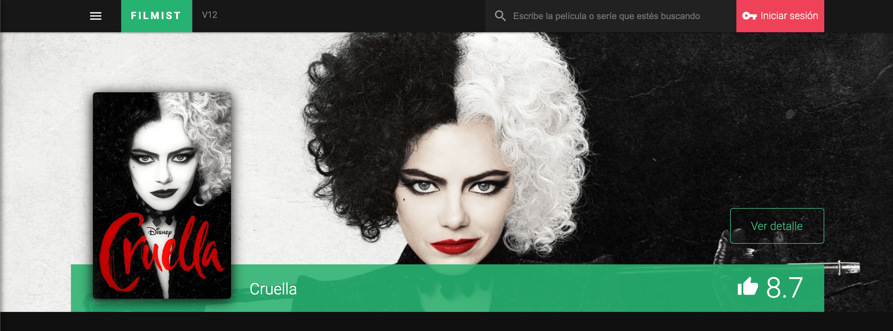

# Filmist

* Angular app to search, sync and share movies and series: https://filmist-angular.web.app/lists

### Migrating application in Angular 2 to Angular 12
____

# TODO

- [ ] Refactor the code. Disclaimer: it is a project developed in 2012.
- [ ] Add types of TypeScript correctly. Too, add models (types and interfaces).
- [ ] Remove the script from Firebase (JS vanilla) and integrate the new version in TypeScript (https://github.com/angular/angularfire).
- [ ] Add unit tests.
- [ ] Add functional tests.
- [ ] Add Storybook.
- [ ] Add docker-compose.

## Development server

Run `ng serve` for a dev server. Navigate to `http://localhost:4200/`. The app will automatically reload if you change any of the source files.

## Code scaffolding

Run `ng generate component component-name` to generate a new component. You can also use `ng generate directive|pipe|service|class|guard|interface|enum|module`.

## Build

Run `ng build` to build the project. The build artifacts will be stored in the `dist/` directory.

## Running unit tests

Run `ng test` to execute the unit tests via [Karma](https://karma-runner.github.io).

## Running end-to-end tests

Run `ng e2e` to execute the end-to-end tests via a platform of your choice. To use this command, you need to first add a package that implements end-to-end testing capabilities.

## Further help

To get more help on the Angular CLI use `ng help` or go check out the [Angular CLI Overview and Command Reference](https://angular.io/cli) page.
